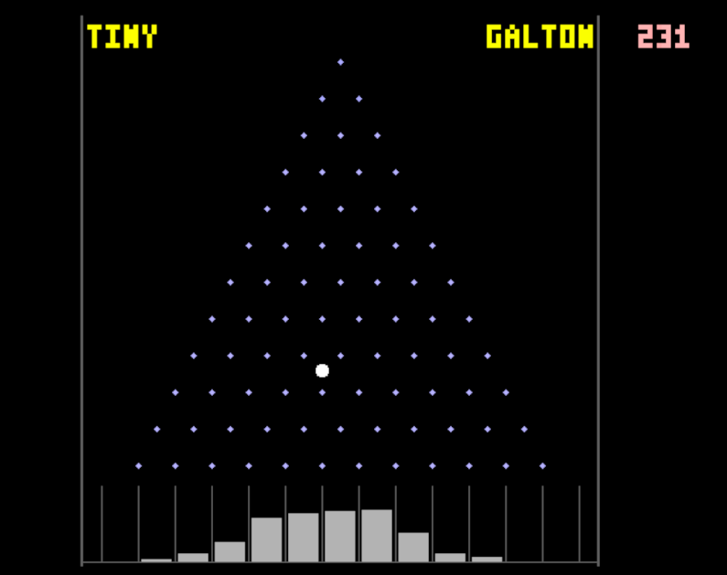

   

# Tiny Tapeout - Tiny Galton Board by Ken Pettit

- [Read the documentation for project](docs/info.md)

## This is a Demoscene project submitted to ttsky26a that presents a Galton Peg Board:

## External hardware

VGA Pmod.
Optional Audio PMOD (output is on uio_out[7]

## Demo in action

- [View on VGA Plaground](https://vga-playground.com/?repo=https%3A%2F%2Fgithub.com%2Fkdp1965%2Fttsky26a-um-pettit-galton)

## Proof of randomness

The Tiny Galton demo uses 3 different length Linear Feedback Shift Registers (LFSRs) to generate "randomness" in 
deciding which way the ball will bounce as it hits a peg on the playing field.  Typical Galton Boards follow a
bell curve distribution where the balls will land.  This demo will collect until any bin reaches a ball count of 0x3BE
(958 decimal), so a full bell curve will be visible.  However this will collect maybe 4200-4300 ball drops, so 
the outer bins may or may not receive any.  

To proove randomness in the LFSR mechanism and that the outer bins are achievable, a C program simulating the ball-drop and LFSR
calculations is included.  It can be compiled as:

   gcc -o galton_lfsr_sim galton_lfsr_sim.c

A sample run simulating 100K ball drops is shown below in both table and bar chart format:

Balls simulated: 1000000

 |bin |   actual  |  expected | act/exp|
 |----|-----------|-----------|--------|
 |  0 |       242 |     244.1 |  0.991 |
 |  1 |      3018 |    2929.7 |  1.030 |
 |  2 |     16457 |   16113.3 |  1.021 |
 |  3 |     53717 |   53710.9 |  1.000 |
 |  4 |    121249 |  120849.6 |  1.003 |
 |  5 |    193259 |  193359.4 |  0.999 |
 |  6 |    225236 |  225585.9 |  0.998 |
 |  7 |    193345 |  193359.4 |  1.000 |
 |  8 |    120904 |  120849.6 |  1.000 |
 |  9 |     53487 |   53710.9 |  0.996 |
 | 10 |     15934 |   16113.3 |  0.989 |
 | 11 |      2926 |    2929.7 |  0.999 |
 | 12 |       226 |     244.1 |  0.926 |

Outer-bin summary:
  bin  0 (12 lefts):  242 hits   (first at ball #4152)
  bin 12 (12 rights): 226 hits   (first at ball #954)

Final LFSR state: l1=0x1e l2=0x120 l3=0x2575

Histogram (max bin = 225236):
                              ███
                              ███
                              ███
                              ███
                          ▆▆▆ ███ ▆▆▆
                          ███ ███ ███
                          ███ ███ ███
                          ███ ███ ███
                          ███ ███ ███
                          ███ ███ ███
                          ███ ███ ███
                          ███ ███ ███
                          ███ ███ ███
                      ▁▁▁ ███ ███ ███ ▁▁▁
                      ███ ███ ███ ███ ███
                      ███ ███ ███ ███ ███
                      ███ ███ ███ ███ ███
                      ███ ███ ███ ███ ███
                      ███ ███ ███ ███ ███
                      ███ ███ ███ ███ ███
                      ███ ███ ███ ███ ███
                      ███ ███ ███ ███ ███
                  ▁▁▁ ███ ███ ███ ███ ███ ▁▁▁
                  ███ ███ ███ ███ ███ ███ ███
                  ███ ███ ███ ███ ███ ███ ███
                  ███ ███ ███ ███ ███ ███ ███
                  ███ ███ ███ ███ ███ ███ ███
              ▂▂▂ ███ ███ ███ ███ ███ ███ ███ ▁▁▁
              ███ ███ ███ ███ ███ ███ ███ ███ ███
      ___ ▃▃▃ ███ ███ ███ ███ ███ ███ ███ ███ ███ ▃▃▃ ___
      ----------------------------------------------------
      00  01  02  03  04  05  06  07  08  09  10  11  12

